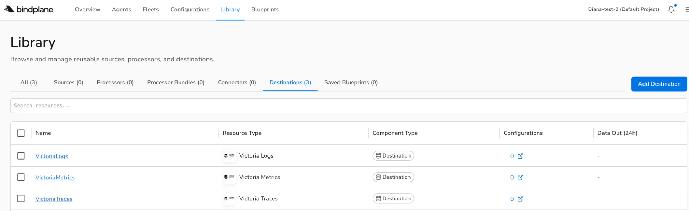
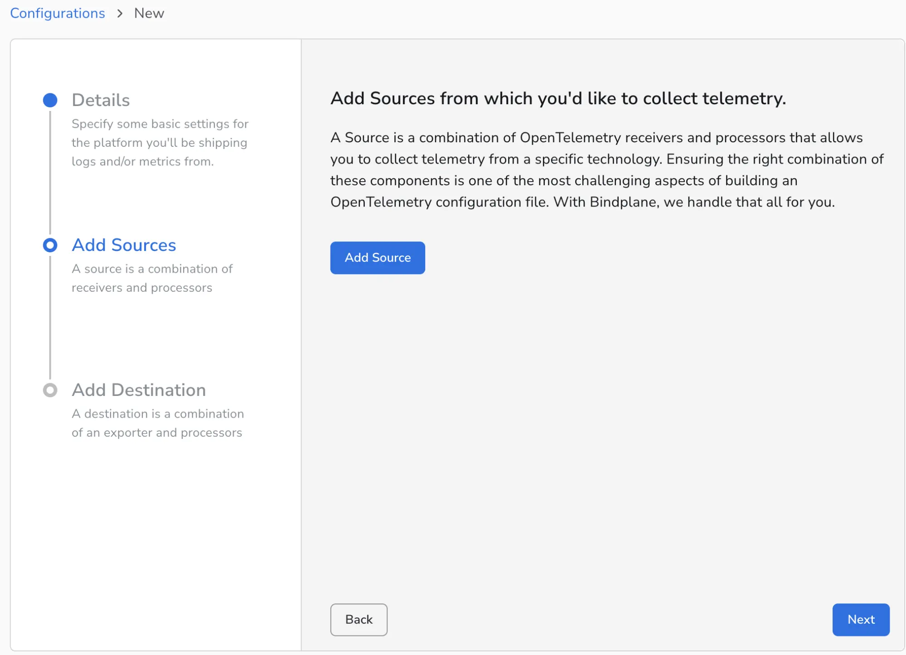
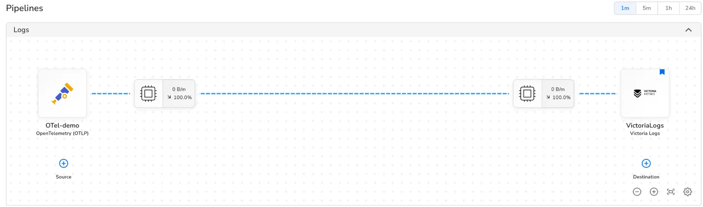

VictoriaLogs integrates with [Bindplane](https://docs.bindplane.com/) via the [Bindplane application](https://app.bindplane.com/).

## Setup the destination

1. Sign up for a Bindplane account.  
2. Go to Agents and install the agent.   
3. Go to the Library and Add Destination. Choose VictoriaLogs.   
4. Configure hostname, port, and headers.  
5. Name the destination and click on Save.

## Add a configuration

1. Go to Configurations, create Configuration.  
2. Give it a name and select the Agent Type and Platform.  
3. Add your telemetry sources such as OTLP, file logs, or cloud services.  
4. Select the destination.

After that Bindplane will start sending logs to VictoriaLogs, and you can query them with LogsQL.

You can check the global view in the Library to view the resource type, component type and configurations.  

For VictoriaMetrics with Bindplane integration, check [this page](https://docs.victoriametrics.com/victoriametrics/integrations/bindplane/).